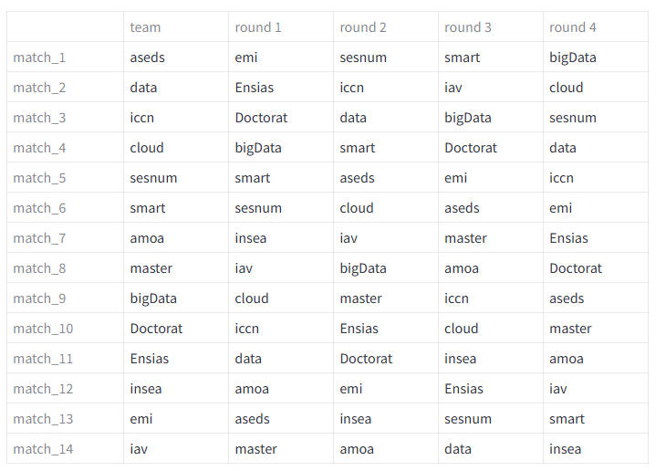

# Football Match Draw System

A handy application for automatically generating football match draws, allowing each team to face unique opponents in a defined number of rounds. Built using Python and Streamlit, this app simplifies tournament organization by ensuring unique pairings, randomized draws, and round-by-round scheduling.

---

## Why This App is Useful ? 
Organizing a tournament, especially with unique pairings across rounds, can be time-consuming and prone to errors if done manually. This Football Match Draw System allows you to:

- Automatically generate unique matches for each team over multiple rounds.
- Avoid manual errors in scheduling.
- Visualize matches in a clear, organized table with easy-to-understand colors.
- Save time and resources for both amateur and professional tournament organizers.

### Features
- Automatic Match Generation: Each team faces a unique opponent each round, ensuring fair and randomized draws.
- Interactive Interface: Simple text inputs allow users to specify teams and rounds, then generate and view results instantly.
- Color-Coded Columns: Matches are displayed with easy-to-read color-coded columns to distinguish teams.
- Hover Effects: Interactive hover styling enhances readability and usability.

--- 
## Requirements

- Python 3.7 or higher
- Streamlit

--- 

## Usage

1. Enter Team Names: In the Enter team names separated by commas field, input the list of teams participating in the tournament.
2. Select Number of Rounds: Adjust the number of rounds for the tournament.
3. Generate Matches: Click "Enter" to see the draw results in the color-coded table, where each team has unique opponents across rounds.

### Example Output
Below is an example of what the output might look like in the app:

--- 
## 🔗 Try this application: 
Access the app in your browser at  .

